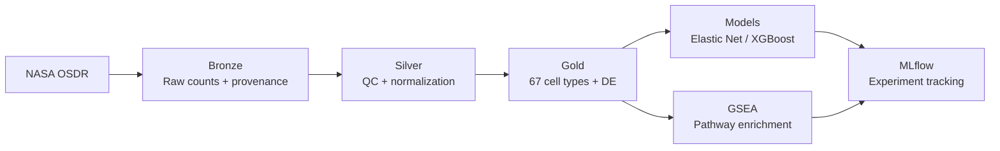

# spaceGen

Single-cell RNA-seq analysis of spaceflight-induced neurodegeneration in mouse brain — built with hexagonal architecture, medallion data layers, and MLflow experiment tracking.

------

## Key Findings

Analysis of 27,968 single nuclei from NASA OSD-352 (Rodent Research-3, mouse brain) reveals that spaceflight induces a neurodegenerative-like molecular signature:

- **Neurodegenerative pathway enrichment:** Spaceflight DE genes in brainstem neurons are significantly enriched in ALS (p=1e-12), Parkinson's (p=6e-10), Huntington's (p=1e-7), and Alzheimer's (p=3e-7) KEGG pathways
- **Microglial neuroinflammation:** Brain immune cells are 4.4x enriched in spaceflight samples, with complement cascade genes (C1qa, C1qb) suppressed
- **Oligodendrocyte metabolic collapse:** Translation, mitochondrial ATP synthesis, and cellular respiration pathways are all downregulated in myelin-producing cells
- **Malat1 as pan-cell-type biomarker:** The stress-responsive lncRNA Malat1 is upregulated across nearly all 67 identified cell types — a known spaceflight biomarker that validates the analysis
- **Cerebellar motor disruption:** Pcp2 (Purkinje cell protein) is strongly downregulated (logFC -3.3), connecting to known astronaut reports of balance issues post-spaceflight

These findings are consistent across independent analyses (differential expression, ML feature importance, GO enrichment, KEGG pathways), strengthening confidence in the biological conclusions.

------

## Pipeline Overview



| Stage | Notebook | What it does |
|-------|----------|-------------|
| Explore | `01_explore_osd352` | Data structure, sample mapping, initial QC |
| Bronze | `02_bronze_ingestion` | Parquet + HDF5 with provenance, Hive partitioning |
| Silver | `03_silver_qc` | Condition-aware QC, normalization, HVGs, PCA/UMAP |
| Gold | `04_gold_clustering` | Leiden clustering, CellTypist annotation, marker validation, DE |
| Features | `05_gold_features` | Pseudobulk aggregation (sample × cell type), ML feature matrix |
| Models | `06_model_training` | Elastic Net, Random Forest, XGBoost with LOSO-CV + MLflow |
| GSEA | `07_gsea` | GO Biological Process + KEGG pathway enrichment |

------

## Architecture

The codebase follows hexagonal (ports and adapters) architecture with medallion data layers.

```
src/spacegen/
├── core/           # Pure functions — no I/O, no side effects
│   ├── qc.py           # Condition-aware QC filtering
│   ├── normalization.py # Normalize, log1p, HVG selection
│   └── features.py      # Pseudobulk aggregation, feature engineering
├── ports/          # Abstract interfaces (DataReader, DataWriter)
└── adapters/       # Concrete I/O (HDF5, h5ad, Parquet, JSON)
```

Core logic takes AnnData in and returns AnnData out — no file paths, no MLflow calls, no database connections. Swapping from local Parquet to S3 or Databricks means adding a new adapter, not touching core code. 18 pytest tests verify all core functions are pure and immutable.

**Medallion layers:**
- **Bronze:** Raw count matrices + provenance metadata, Hive-style partitioned
- **Silver:** QC-filtered (condition-aware mt% thresholds), normalized, 2,000 HVGs
- **Gold:** 22 Leiden clusters, 67 CellTypist cell types, DE results, ML features

------

## Dataset

Data from the **NASA Open Science Data Repository (OSDR)**, dataset OSD-352 (Rodent Research-3 mission).

| Property | Value |
|----------|-------|
| Organism | Mus musculus |
| Tissue | Brain |
| Platform | 10X Genomics snRNA-seq |
| Cells | 32,243 raw → 27,968 after QC |
| Genes | 32,285 |
| Samples | 5 (3 Space Flight, 2 Ground Control) |
| Cell types | 67 (CellTypist Mouse_Whole_Brain, validated with 21 canonical markers) |
| Reference | Masarapu et al., Nature Communications (2024) |

**Condition-aware QC:** Standard 5% mitochondrial threshold for ground control, relaxed 10% for spaceflight samples to preserve biologically relevant stressed cells. This asymmetric approach retains spaceflight biology that uniform filtering would discard.

------

## ML Classification

Spaceflight vs ground control classifier using pseudobulk features (sample × cell type aggregation to avoid pseudoreplication).

| Model | Accuracy | F1 | AUROC |
|-------|----------|-----|-------|
| Elastic Net | 0.574 | 0.646 | **0.757** |
| Random Forest | 0.593 | 0.703 | 0.548 |
| XGBoost | 0.593 | 0.744 | 0.440 |

Limited accuracy is expected with n=5 biological samples. The value is in proper methodology (LOSO-CV, pseudobulk, no pseudoreplication) and feature importance analysis revealing mitochondrial stress genes (Cox8a, Ndufs5, Ndufb7) and cell type composition as top discriminators.

All experiments tracked with MLflow. Run `mlflow ui --backend-store-uri file:mlruns` from the project root to view.

------

## Portfolio Context

Third project in a computational biology portfolio following data through chromosome structure → chromatin accessibility → gene expression:

- **[GenBrowser](https://h4rrye.github.io/genBrowser)** — 3D chromosome visualization (Three.js/TypeScript)
- **[ChromApipe](https://github.com/h4rrye/chromApipe)** — Nextflow pipeline for Chromosome Surface Accessible Area (AWS Batch)
- **spaceGen** — scRNA-seq ML pipeline for spaceflight biology (hexagonal architecture, MLflow)

Each project demonstrates a different architectural pattern and a different layer of the biology.

------

## Tech Stack

Scanpy, AnnData, CellTypist, scikit-learn, XGBoost, MLflow, GSEApy, Pandas, SciPy, Matplotlib, pytest

------

## Future Work

- **Phase 2:** ATAC-seq integration (OSD-352 is multiome — RNA + ATAC from same nuclei)
- **Phase 3:** Autonomous hyperparameter optimization with GLM-5.1
- **Visualization:** Interactive D3.js plots (cell networks, UMAP clusters, pathway enrichment)
- **Multi-tissue:** Extend to RRRM-1 datasets (spleen, liver, blood) when processed data is released

------

## Author

**Harpreet Singh** — MSc Data Science, UBC | Computational Biology & Machine Learning
