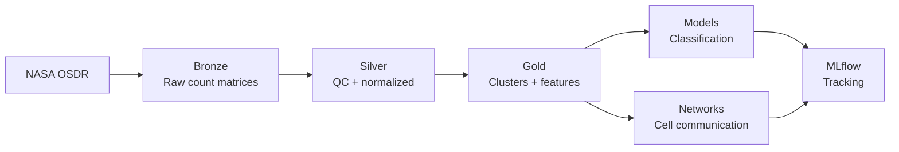

# spaceGen

**Single-cell RNA-seq pipeline for spaceflight biology — hexagonal architecture, medallion data layers, MLflow tracking**

------

## Overview

spaceGen is an ML pipeline for analyzing NASA OSDR spaceflight single-cell transcriptomics data. It processes 10X Genomics scRNA-seq from the RRRM-1/Rodent Research-8 mission to identify how spaceflight alters gene expression at single-cell resolution across multiple tissues in the same cohort of mice.

The pipeline performs QC, normalization, clustering, cell type annotation, differential expression, and cell-cell communication network analysis using Scanpy. It classifies spaceflight vs ground control samples and identifies conserved stress-response signatures, immune dysregulation patterns, and tissue-specific molecular changes. Cross-tissue comparison reveals which spaceflight responses are systemic versus organ-specific.

The codebase uses hexagonal (ports and adapters) architecture to separate core bioinformatics and ML logic from I/O and infrastructure. The same pipeline runs locally against Parquet files during development and can be pointed at cloud storage by swapping adapters, with no changes to core logic. Data flows through a bronze/silver/gold medallion architecture, and all experiments are tracked with MLflow.

------

## Portfolio Context

This is the third project in a computational biology portfolio that follows data through chromosome structure → chromatin accessibility → gene expression:

- **[GenBrowser](https://h4rrye.github.io/genBrowser)** — 3D interactive chromosome visualization (Three.js/TypeScript). Maps biological metrics like GC content and surface distance onto chromosome backbone geometry.
- **[ChromApipe](https://github.com/h4rrye/chromApipe)** — Nextflow pipeline computing Chromosome Surface Accessible Area (CSAA) from PDB structures, with parallel API annotation from Ensembl, ENCODE, and GTEx. Dataflow architecture with Docker-containerized processes deployed to AWS Batch.
- **spaceGen** — scRNA-seq ML pipeline modeling single-cell gene expression responses to spaceflight. Hexagonal architecture with medallion data layers, network analysis, and MLflow experiment tracking.

Each project demonstrates a different architectural pattern (interactive frontend, dataflow pipeline, ports-and-adapters application) and a different layer of the biology (structure, accessibility, expression).

------

## Architecture

**Hexagonal design:** Core logic in `src/spacegen/core/` is pure — functions take AnnData objects and dataframes in and return them out, with no file I/O or MLflow calls. Ports (`ports/interfaces.py`) define abstract contracts for data reading, writing, and experiment logging. Adapters (`adapters/`) implement those contracts for local Parquet/h5ad and MLflow. Swapping to S3 or Databricks means adding a new adapter, not touching core code.

**Medallion layers:**

- **Bronze:** Raw gene-cell count matrices and sample metadata from NASA OSDR, partitioned by ingest date (Hive-style)
- **Silver:** QC-filtered cells, normalized counts, highly variable genes, doublet flags — versioned per tissue
- **Gold:** Clustered cells with type annotations, differential expression results, network features, study-aware splits — versioned
- **Models:** Trained classifiers and network artifacts logged to MLflow with full parameter and metric tracking

------

## Datasets

Data sourced from the **NASA Open Science Data Repository (OSDR)**, RRRM-1/Rodent Research-8 mission. All datasets are Mus musculus, 10X Genomics scRNA-seq, spaceflight vs ground control, released February 2026. Using GeneLab-processed count matrices (post-alignment) as the starting point.

| OSD     | Tissue | Factors          | Biology                                    |
| ------- | ------ | ---------------- | ------------------------------------------ |
| OSD-910 | Spleen | Spaceflight, Age | Immune cell diversity, signaling networks  |
| OSD-905 | Liver  | Spaceflight, Age | Metabolic disruption, stress response      |
| OSD-918 | Blood  | Spaceflight, Age | Circulating immune cells, systemic markers |

Pipeline development starts with spleen (OSD-910) for its rich immune cell type diversity, then extends to liver and blood for cross-tissue comparison.

------

## Pipeline Design

The pipeline has four stages, each writing to a separate medallion layer.

The **bronze** stage ingests processed gene-cell count matrices and metadata from NASA OSDR, storing them with study provenance and Hive-style ingest date partitioning. Data integrity is verified via MD5 checksums.

The **silver** stage uses Scanpy for QC filtering (mitochondrial %, doublet removal, low-quality cells), normalization (library size correction, log transformation), highly variable gene selection, and dimensionality reduction (PCA). Batch effects are assessed and visualized.

The **gold** stage performs KNN graph construction, Leiden clustering, cell type annotation, and differential expression analysis (spaceflight vs ground within each cell type). Cross-tissue gene ID alignment and feature engineering for ML classification happen here. Cell-cell communication network analysis identifies how intercellular signaling changes under spaceflight conditions. Jaccard similarity quantifies transcriptional overlap between clusters across conditions and tissues.

The **modeling** stage trains classifiers (elastic net, XGBoost) to predict spaceflight exposure from single-cell features. All runs are logged to MLflow with parameters, metrics (AUROC, AUPRC, F1), and artifacts (UMAP plots, SHAP importance, confusion matrices, network visualizations).

------

## Analysis Highlights

- **Cell type resolution:** Identify which specific cell types (T cells, macrophages, hepatocytes, etc.) are most affected by spaceflight
- **KNN graphs + Leiden clustering:** Graph-based cell population identification at single-cell resolution
- **Cell-cell communication networks:** How intercellular signaling rewires under microgravity
- **Jaccard similarity:** Quantify transcriptional overlap between spaceflight and ground clusters to find conserved vs divergent responses
- **Cross-tissue comparison:** Systemic spaceflight signatures (shared across spleen, liver, blood) vs tissue-specific responses

------

## Current Status

Project is in active development. Conda environment created, datasets identified. Starting with data exploration and ingestion of OSD-910 (spleen) count matrices into the bronze layer. Architecture will be built incrementally around working code.

------

## Author

**Harpreet Singh** MSc Data Science, UBC Computational Biology & Machine Learning